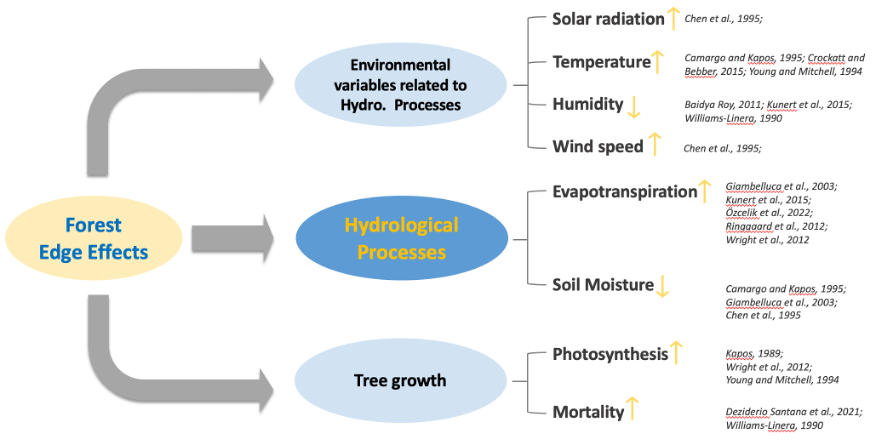

# Introduction

Numerous studies across the world have unveiled the intricate
relationship between forests and water
[@bertrand-krajewski_distribution_1998; @leutnant_stormwater_2016].This
profound connection arises from the crucial role that forests play in
the water cycle, affecting not only water supply in both social and
natural systems but also aquatic habitat and biodiversity conservation.

In British Columbia (BC), where forests cover nearly 64% of the land,
watershed management practices involve dealing with a range of forest
disturbances from anthropogenic disturbances (e.g., timber harvesting,
agriculture) to natural disturbances (e.g., insect infestation,
wildfire). Over the past decades, there have been a fair number of
studies addressing the forest-water relationship, which confirmed forest
cover changes are significantly associated with alterations in
streamflow, posing a noticeable threat to water supply.

Literature suggests that... (Figure \ref{fig:fig1})

```{r,fig1, echo=FALSE , out.width="70%",fig.cap="A figure added from a folder.\\label{fig:fig1}"}

```


# Materials and Methods

## Study area

Our study area is the Duteau community watershed, located approximately
20 km southeast of the City of Vernon (Figure S1). It has a total
drainage area of 213 km2, ranging in elevation from 520 m at its
confluence with Bessette Creek to over 1,800 m in the Grizzly Hills. It
is a snow-dominated system with peak flows occurring from late-April to
mid-June. Since the 1890's, the watershed has been developed for
irrigation and water supplies, providing 60 per cent of Vernon's
drinking water and serving a population in the Greater Vernon area of
more than 50,000 \## Data processing and analysis Processes include: 1.
First step 2. Second step 3. Third step

## Data analysis

```{=tex}
\begin{equation}
E = MC^2
\end{equation}
```
# Results

Results suggested (see \ref{fig:fig2} and \ref{tab:tab1}): 

- First bullet 
- Second bullet 
- Third bullet


```{r fig2, echo=FALSE, fig.width=3, fig.cap="A figure added with a code chunk.\\label{fig:fig2}"}
x = rnorm(10)
y = rnorm(10)
plot(x, y)
```


```{r tab1, echo=FALSE}
knitr::kable(mtcars[1:5, 1:3], format = "latex", 
             booktabs = TRUE, 
             caption = "Table created based on mtcars.", 
             align = 'ccc', centering = FALSE,
             table.envir = "table", position = "H")
```

# Discussion

The results are consistent with the previous findings ...

# Conclusion

We conclude that...
